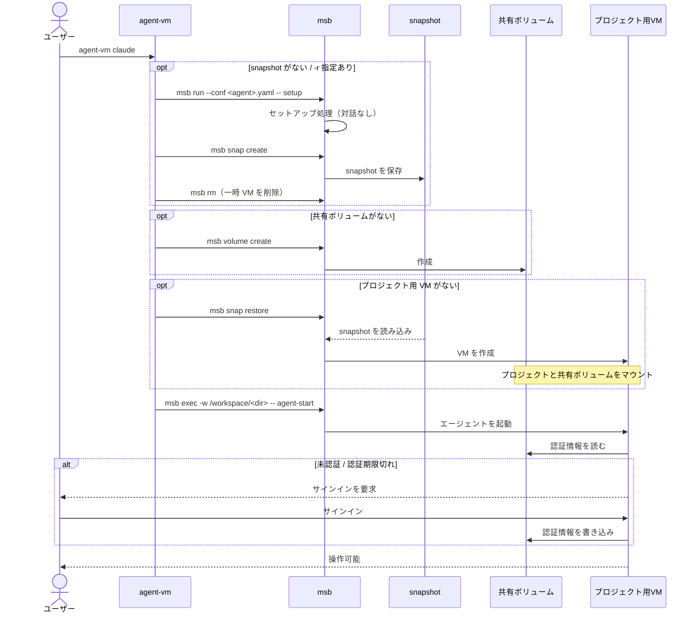

# Agent-VM

## 概要
AIエージェントCLIを複数VM上で動作させる際の、各VMにおけるセットアップと認証を省略するためのスクリプトです。

## 解決したかった問題

VMを生成する度に、セットアップ処理が実行されるのと、処理完了までに数分かかります。

ちなみに具体的には以下の処理が実行されます。
```
- ベースイメージの取得
- apt install
- npm install
```

また、認証情報がVM内に保存されるため、AIエージェントの認証を各VMで行う必要があります。
そのため、複数VMでAIエージェントを起動させたい場合、すべてのVMで認証が必要になります。

## 解決の方針
- microsandboxのsnapshot機能を用いて、セットアップ処理完了時のVMをsnapshotとして保存し、新規VMを起動する際に使い回すことで、セットアップ処理を省略します。
- ホスト側にmicrosandbox用の共有ボリュームを作成し、各VMからマウントすることで、いずれかのVMで取得した認証情報を共有ボリュームに配置しつつ、他VMで使い回します。これにより、複数VMでの認証をスキップします。

---

## 動作環境

- **microsandbox が動作する環境**（[公式の要件](https://docs.microsandbox.dev/getting-started/quickstart)を参照）
- 使用するエージェントのアカウント
  - Claude Code の場合は **Claude のサブスクリプション**（初回に 1 回だけサインインします）

---

## セットアップ

### 1. microsandboxのインストール

[公式のインストール手順](https://docs.microsandbox.dev/getting-started/quickstart)に従ってください。

### 2. スクリプトの配置と読み込み

[`agent-vm.sh`](./agent-vm.sh) の内容をコピーして、`~/.zsh/agent-vm.zsh` として保存します。

```sh
mkdir -p ~/.zsh
```

`~/.zshrc` の末尾に読み込む行を追加します。bash の場合は `~/.bashrc` です。

```sh
echo 'source ~/.zsh/agent-vm.zsh' >> ~/.zshrc
source ~/.zshrc
```

> 置き場所は好みで構いません。すでに `~/.config/zsh/` などで設定を分割している場合は、そちらに合わせて `source` のパスを変えてください。

### 3. 使いたいエージェントの設定を配置する

[`conf/`](./conf/) から、使いたいエージェントの yaml を `~/.agent-vm/conf/` にコピーします。

```sh
mkdir -p ~/.agent-vm/conf
```

| エージェント | コピー元 | 配置先 |
|---|---|---|
| Claude Code | `conf/claude.yaml` | `~/.agent-vm/conf/claude.yaml` |
| Codex | `conf/codex.yaml` | `~/.agent-vm/conf/codex.yaml` |
| Gemini CLI | `conf/gemini.yaml` | `~/.agent-vm/conf/gemini.yaml` |


※Claude Codeしか動作確認できてない。。

ここに無いエージェントは[カスタマイズ](#カスタマイズ)を参照してください。

### 4. 初回実行

エージェントを使いたいリポジトリで実行します。

```sh
cd ~/dev/my-project
agent-vm claude
```

初回は次の順に処理が走ります。

1. **セットアップ処理**（数分）。完了時点の VM が**スナップショットとして保存**されます。
2. そのスナップショットから、このプロジェクト用の VM が作られます。
3. エージェントが起動し、**サインインを求められます**。

サインインすれば、そのまま作業を続けられます。認証情報はホスト側の共有ボリュームに保存されます。

---

## コマンドについて 

```sh
agent-vm <agent> [name] [-r]
```

| 例 | 動作 |
|---|---|
| `agent-vm claude` | カレントディレクトリ用の VM で Claude Code を起動 |
| `agent-vm codex` | 同じディレクトリで Codex を起動（VM は別） |
| `agent-vm claude my-vm` | VM 名を明示する |
| `agent-vm claude -r` | セットアップ処理をやり直してスナップショットを更新する |

- VM 名は `<agent>-<ディレクトリ名>` が既定です。
- `-r` は、yaml を書き換えてエージェントのバージョンを上げたときなどに使います。既存のVM には影響せず、以降に作る VM から新しいスナップショットが使われます。

---

## Agent-VM の仕組み

### 全体像

```
~/.agent-vm/conf/claude.yaml              ← VM の設定（イメージ・リソース・セットアップ処理）
       │
       │  ① 初回のみ：セットアップ処理を実行して凍結（対話なし）
       ▼
~/.agent-vm/claude.msb                    ← セットアップ処理完了時のsnapshot
       │
       │  ② 以降：ここから各プロジェクトの VM を復元
       ├──────────────┬──────────────┐
       ▼              ▼              ▼
  claude-proj-a   claude-proj-b   claude-proj-c
       │              │              │
  /workspace/proj-a  ...            ...     ← ホストのプロジェクトをマウント
       │              │              │
       └──────────────┴──────────────┘
                      │
                      ▼
~/.microsandbox/volumes/claude-auth/      ← 認証情報と会話履歴（全 VM で共有）
```

※会話履歴もclaude-auth配下に保存されるので、もしかしたら別VMのコンテキストを参照できるのかもしれない。

### 処理フロー 




---

## カスタマイズ

### 環境変数

`~/.zshrc` の `source` する行より**前**に書いてください。

| 変数 | 既定値 | 用途 |
|---|---|---|
| `AGENT_VM_HOME` | `~/.agent-vm` | 雛形スナップショットの保存先 |
| `AGENT_VM_CONF_DIR` | `$AGENT_VM_HOME/conf` | `<agent>.yaml` を置くディレクトリ |
| `AGENT_VM_MEM` | （yaml の値） | メモリの上書き。例 `2G` |
| `AGENT_VM_DISK` | `4G` | ルートディスクのサイズ |

メモリが厳しい場合は絞ってください。

```sh
export AGENT_VM_MEM=2G
```

### エージェントを追加する

`~/.agent-vm/conf/<name>.yaml` を 1 枚足すだけです。Claude 用との差分は、**インストールするパッケージ・起動コマンド・認証情報の保存先**です。

```yaml
# ~/.agent-vm/conf/opencode.yaml
#
# agent-vm: auth-dir=/root/.opencode

image: "node:24-bookworm-slim"
cpus: 2
memory: "2G"

scripts:
  setup: |
    apt-get update
    apt-get install -y --no-install-recommends ca-certificates git
    npm install -g opencode-ai@1.18.4

    printf '%s\n' \
      '#!/bin/sh' \
      'exec opencode "$@"' \
      > /usr/local/bin/agent-start
    chmod +x /usr/local/bin/agent-start
```

- **`# agent-vm: auth-dir=...`** … 認証情報の保存先。ここに共有ボリュームがマウントされます。省略すると `/root/.<agent>` が使われます。
- **`setup`** … 雛形の作成時に実行されます。**対話操作を含めないでください**（サインインは初回のプロジェクト VM で行います）。
- **`agent-start`** … プロジェクト VM で起動するコマンドです。

`agent-vm opencode` で使えるようになります。

microsandbox 公式が手順を公開していて、同梱していないエージェントは以下のとおりです。

| 引数の例 | インストール | 起動コマンド |
|---|---|---|
| `opencode` | `npm i -g opencode-ai` | `opencode` |
| `pi` | `npm i -g @mariozechner/pi-coding-agent` | `pi` |
| `goose` | バイナリ取得（ベースイメージは `debian:bookworm-slim`） | `goose session` |

詳細は [microsandbox のエージェント例](https://docs.microsandbox.dev/examples/overview)を参照してください。

---

## 既知の制約・未検証

- **microsandbox は beta です。** 公式が破壊的変更の可能性を明記しており、CLI の仕様変更でこの関数が動かなくなることがあります。
- **`msb ls` / `msb volume ls` の出力に依存しています。** 存在確認に `grep` を使っているため、出力形式が変わると誤判定します。
- **認証情報はホスト上に平文で保存されます。** 実体は `~/.microsandbox/volumes/<agent>-auth/` です。**このディレクトリは共有しないでください。**
- **複数の VM から同時に認証情報へ書き込まれた場合の挙動は未検証です。** トークンの更新は数時間に 1 回程度のため衝突する可能性は低いものの、保証はありません。
- **VM 内で Docker / Docker Compose を動かす構成には未対応です。** microsandbox 自体はサポートしていますが、ルートディスクの構成が変わるため別途対応が必要です。

---

## 参考リンク

- [microsandbox](https://microsandbox.dev) / [ドキュメント](https://docs.microsandbox.dev)
- [microsandbox — AI エージェントの実行例](https://docs.microsandbox.dev/examples/overview)
- [microsandbox — 設定ファイルのリファレンス](https://docs.microsandbox.dev/cli/configuration)
- [Claude Code](https://code.claude.com/docs)
